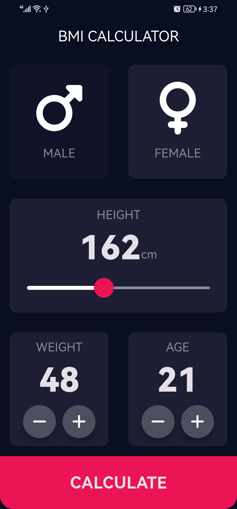
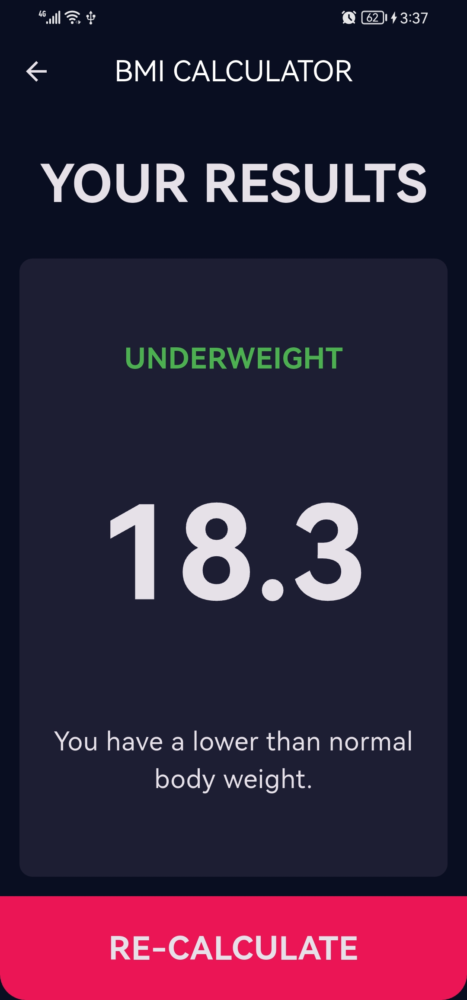
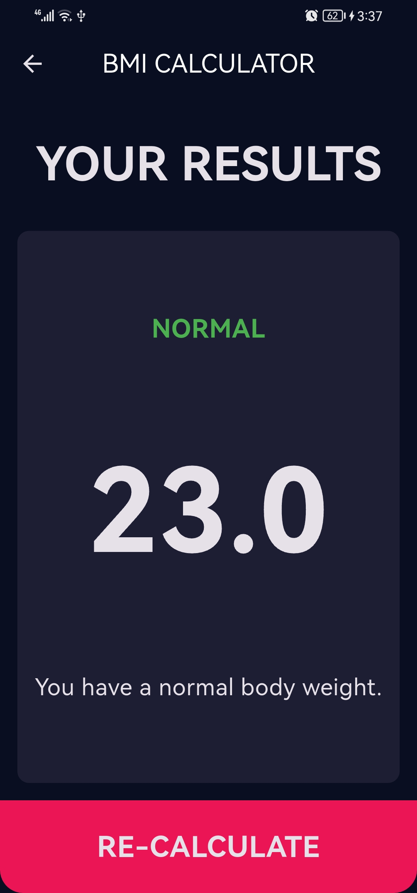

# 🧮 BMI Calculator - Body Mass Index App

A simple and elegant Flutter application to calculate your Body Mass Index (BMI) and determine your health status based on your height and weight.

## ✨ Overview

This app helps users determine whether they are underweight, normal, or overweight based on their Body Mass Index (BMI). The interface is clean and user-friendly, making it ideal for anyone who wants a quick health check.

## 🚀 Features

- Input your **height** and **weight**
- Instantly calculate your **BMI**
- View a **health status message** based on your result
- Clean and intuitive UI built with Flutter

## 📸 Screenshots

## 🛠️ Built With

- Flutter
- Dart
